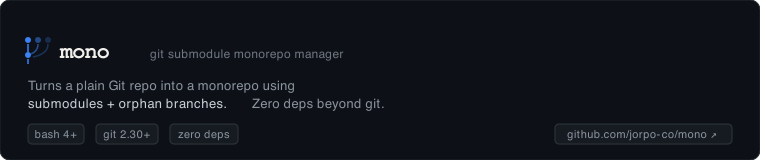

You have a codebase with multiple components — an auth service, an API layer, shared libraries, frontends. They need to evolve independently (different teams, different cadences) but deploy together (atomic releases, shared CI). Separate repos give you isolation but make cross-repo changes a multi-PR nightmare. Traditional monorepos give you atomic deploys but lose isolation — `git log` is noise, CI fires on every touch, and AI agents step on each other.

**mono gives you both.**

Each module lives on its own orphan branch with its own commit history. `git log modules/auth` shows only auth's changes. An agent working in `modules/auth` cannot touch files in `modules/api`. But it's all *one* git repo, so cross-module refactoring is a single commit, deploys are atomic, and `mono push` sends everything — every branch, every tag — in one command.

The parent repo pins exact versions of each module via git submodule pointers. Reproducible builds come for free. No lockfile, no manifest, no orchestration layer. Just git.

### Why mono for human + agent teams

This pattern is especially powerful when humans and AI agents collaborate:

- **Agents work in isolation.** Give each agent its own module. Agent A rebuilds `auth`, Agent B works on `api`. They never touch each other's files. No merge conflicts from concurrent agent edits.
- **Humans gate the versions.** Agents develop inside their module. Humans review the output, tag a version, and pin it in the parent. The parent stays stable while agents experiment.
- **Dependency chains are explicit.** `api` depends on `auth` at version X.Y.Z. An agent upgrading `auth` produces a new tag. The `api` agent can adopt it deliberately, not accidentally.
- **Reproducible by default.** Every parent commit records exactly which module versions it needs. CI, deploy, and local dev all agree.

---

## Quick start

Five commands, thirty seconds:

```bash
# 1. Create a repo and init
mkdir my-project && cd my-project
git init
./mono init

# 2. Add your first module
./mono module add auth

# 3. Work inside the module (it's just a git repo)
cd modules/auth
echo 'export const auth = () => {}' > index.ts
git add index.ts && git commit -m "init auth"
cd ../..

# 4. Tag a release and pin it in the parent
./mono module tag --pin auth v0.1.0
# → Tagged modules/auth as modules/auth/v0.1.0, pinned in parent

# 5. Push everything at once
./mono push
```

---

## Common workflows

### Adding a module and shipping a change

```bash
./mono module add auth          # creates orphan branch + submodule
cd modules/auth                 # work happens here
git log                         # only auth history
# ... develop ...
git commit -m "feat: add login"
cd ../..
./mono module tag --pin auth v1.0.0   # tag release + pin parent
./mono push                           # push everything
```

### Agent isolation — the killer pattern

```
┌─────────────────────────────────────────────────────┐
│  Parent repo (main branch)                          │
│  ├── modules/auth  → pinned to v1.0.0               │
│  ├── modules/api   → pinned to v2.1.0               │
│  ├── modules/web   → pinned to v0.3.0               │
│                                                     │
│  Agent A: works in modules/auth                     │
│  Agent B: works in modules/api                      │
│  Agent C: works in modules/web                      │
│  ── No file overlap ── No merge conflicts ──        │
└─────────────────────────────────────────────────────┘
```

```bash
# 1. Clone (anyone on any machine)
git clone <url>
cd repo && mono clone

# 2. Agent works on auth module — fully isolated
cd modules/auth
# ... agent makes changes ...
git commit -m "refactor auth"
cd ../..

# 3. Agent creates a tag (no parent update)
./mono module tag auth v2.0.0

# 4. Human reviews, pins parent
./mono module pin auth v2.0.0    # only if it looks good
git push origin main              # deploy the pinned version

# Meanwhile, Agent B works on api/ — completely independent
cd modules/api
# ... agent work ...
```

### Deploying a stable snapshot

```bash
# Pin all modules to their latest tags
./mono module pin auth v1.2.0
./mono module pin api v2.0.1
./mono module pin web v0.5.0

# Commit and push
git commit -m "release: pin all modules"
./mono push

# Next dev clones and gets exactly these versions
git clone <url>
cd repo && mono clone
```

### Upgrading a shared dependency

```bash
# Agent upgrades libs/strutils
cd libs/strutils
# ... changes ...
git commit -m "perf: optimize string operations"
cd ../..
./mono module tag --pin libs/strutils v0.6.0

# Other modules adopt the new version deliberately
# No forced breakage — each module pins independently.
```

### Onboarding a new developer

```bash
git clone <url> && cd repo
mono clone          # one command: submodules + alternates + branches
# Ready to work. Every module at the pinned version.
```

### Splitting an existing folder into a module

```bash
# You've been building services/auth in-tree. Time to isolate it.
./mono module split services/auth
# → services/auth is now a submodule with full history preserved
# → main no longer tracks those files directly
```

### Multi-root project (group modules by type)

```bash
./mono init --roots services,libraries,tools --default-root services

./mono module add services/auth        # services/auth/
./mono module add services/api         # services/api/
./mono module add -r libraries strutils  # libraries/strutils/
./mono module add tools/build          # tools/build/

# All in one repo. All push together. All clone together.
```

---

## Table of Contents

- [Architecture](#architecture)
- [Design Rationale](#design-rationale)
- [Setup](#setup)
- [Commands](#commands)
  - [`init`](#init)
  - [`clone`](#clone)
  - [`setup`](#setup)
  - [`push`](#push)
  - [`config`](#config)
  - [`module` (list)](#module-list)
  - [`module add`](#module-add)
  - [`module split`](#module-split)
  - [`module tag`](#module-tag)
  - [`module pin`](#module-pin)
  - [`module version`](#module-version)
  - [`module remove`](#module-remove)
- [Module specification (three forms)](#module-specification-three-forms)
- [Tag naming convention](#tag-naming-convention)
- [Clone workflow](#clone-workflow)
- [Requirements](#requirements)

---

## Architecture

```
repo/
├── main                            ← base branch, holds submodule pointers
├── modules/auth/main               ← orphan branch, auth module's history
├── modules/api/main                ← orphan branch, api module's history
├── libs/strutils/main              ← orphan branch, lib's history
│
├── .git/
│   ├── refs/heads/main
│   ├── refs/heads/modules/auth/main
│   ├── refs/tags/v0.0.0            ← global root tag
│   ├── refs/tags/modules/auth/v0.0.0 ← module root tag
│   ├── refs/tags/modules/auth/v1.2.0
│   └── modules/modules/auth/       ← submodule git dir (clone of parent)
│       ├── objects/                ← submodule's own object store
│       └── objects/info/alternates ← link to parent objects
│
├── modules/auth/                   ← submodule working tree
├── modules/api/
└── libs/strutils/
```

### Key concepts

**Orphan branches.** Each module lives on an orphan branch (`<root>/<name>/main`) that shares no commit history with other branches. All branches live in the same repo — no separate remotes.

**Submodules.** Modules are registered in `.gitmodules` with `git submodule add`. The URL is `./` (self-reference), so the submodule is a clone of the parent repo into `.git/modules/<path>/`.

**Object sharing.** Parent and submodule share object stores via bidirectional alternates. This lets the parent create annotated tags pointing to submodule commits. Alternates are auto-configured on `module add` and regenerated by `mono clone` / `mono setup`.

**Prefixed refs.** Branches, tags, and directories all use the `<root>/<name>` prefix to avoid collisions between modules.

---

## Design Rationale

### Why submodules (not worktrees)

**Version pinning requires gitlinks.** mono's core feature is that the parent repo records exactly which version of each module it depends on. Git submodules provide this natively via **gitlinks** — special tree entries in the parent commit that store a module's exact SHA. Run `git ls-tree HEAD modules/auth` and you get a pointer to a specific commit. Every checkout of that parent commit gets the same module version. Reproducible builds come for free.

**Worktrees cannot pin.** `git worktree add modules/auth modules/auth/main` creates a checkout of the orphan branch, but the parent's tree has zero record of it. The worktree directory shows as untracked or an embedded repo. To pin versions with worktrees, you must reimplement gitlinks in a manifest file (`mono.lock`) — which is a worse, user-managed version of what submodules already do natively.

**Worktrees don't survive clone.** Worktrees are local admin — `git clone` transfers branches and tags but not worktrees. Each clone requires `git worktree add` for every module. That's strictly more commands than `git submodule update --init --recursive`, which at least auto-creates directories from `.gitmodules`.

**Embedded repo noise.** Each worktree inside the main tree has a `.git` file. Tools get confused, `git clean -dfx` nukes the worktree, `git status` shows untracked noise. Submodules are recognized by git and handled cleanly.

### Why alternates (not direct `--git-dir` access)

mono creates **annotated tags** in the parent namespace that point to submodule commits: `modules/auth/v1.2.0`. An annotated tag is a git object that must resolve the commit it points to. The commit object lives in the **submodule's object store** (`.git/modules/modules/auth/objects/`), not the parent's.

Alternates tell the parent object store "if you don't find an object here, look over there." This is the standard git mechanism for object sharing (git itself uses it for submodule object stores). The alternative — routing every tag operation through `git --git-dir=.git/modules/modules/auth` — is fragile and doesn't compose with git commands that expect the parent's ref namespace.

### Why orphan branches (not shared history)

Each module gets its own orphan branch (`modules/auth/main`) starting from the `v0.0.0` root tag. This means:
- No shared commit history between modules — `git log modules/auth/main` shows only auth commits
- No merge conflicts between modules — branches diverge from commit 1
- Modules can be garbage-collected independently
- `git clone --single-branch modules/auth/main` fetches only that module's history

### Why self-referencing URL (`./`)

`git submodule add ./ ./modules/auth` tells git "the submodule source is this same repo." This means:
- No separate remote to configure per module
- All objects are already in one place (with alternates bridging stores)
- One `git push` sends all data — main branch, all module branches, all tags
- One `git clone` + alternates setup and everything is available

### What mono does NOT solve

- **No sandboxed filesystem per module.** Submodule working trees share the parent's filesystem. A module can access files outside its directory if given permission. This is a feature for shared config, not a bug.
- **No partial clone.** `git clone` always fetches all branches and all objects. Use `--single-branch` + `--depth` if you need shallow clones.
- **No CI isolation.** mono tracks versions but doesn't enforce build isolation. Each module's CI pipeline must be configured separately.

### Files

| File | Purpose |
|---|---|
| `.gitmono` | Config: roots, default-root, base branch |
| `.gitmodules` | Standard Git submodule declarations |

---

## Setup

Requires a **fresh repo with no commits**:

```bash
./mono init                                                  # single root: modules
./mono init --roots modules,libs,plugins                     # multiple roots
./mono init -r libs,plugins                                  # shorthand
./mono init --roots modules,libs --default-root libs          # custom default root
```

Creates `.gitmono`:

```ini
[mono]
  roots = modules,libs,plugins
  default-root = modules
  base = main
```

**Roots** are top-level directories that group modules by type. Each root gets its own branch prefix (`<root>/<name>/main`) and submodule directory (`<root>/<name>/`). Same module name in different roots never collides.

**Default root** is used when a bare module name is given without an explicit root.

---

## Commands

### `init`

Initialize the repo as a monorepo.

```
mono init [--roots <csv> | -r <csv>] [--default-root <root>]
```

Creates an empty root commit, tags it `v0.0.0`, and writes `.gitmono`. If `--default-root` is omitted, the first root in the list becomes the default.

### `clone`

Full checkout after `git clone`.

```
mono clone
```

Runs `git submodule update --init --recursive` then delegates to `mono setup`. Use this as the single command after cloning a mono repo.

### `setup`

Prepare submodules for development. Safe to re-run anytime.

```
mono setup
```

For each registered module:
1. Regenerates bidirectional alternates (idempotent — safe to re-run)
2. Switches the submodule from detached HEAD to its tracked branch

Run this after `git clone --recurse-submodules` to skip the submodule fetch. Also run it after any `git pull` that updates submodule pointers — it's a no-op if nothing changed.

### `push`

Push everything — main, all module branches, and all tags.

```
mono push
```

Pushes:
1. The base branch (usually `main`)
2. Every module's orphan branch (`<root>/<name>/main`)
3. All tags (including module version tags)

One command, no forgotten branches. Prevents the common monorepo pitfall: pushing main but forgetting to push submodule branches, leaving the next clone with broken submodule pointers.

### `config`

Read or write `.gitmono` config.

```
mono config <key> [<value>]        # read or write a key
mono config --root-list            # list configured roots
mono config --default-root         # show default root name
```

Values are stored in git-config format under the `[mono]` section.

### `module` (list)

List registered submodules.

```
mono module
```

Prints one path per line (e.g. `modules/auth`, `libs/strutils`). Reads from `.gitmodules`.

### `module add`

Create a new module — orphan branch + submodule + alternates.

```
mono module add [-r <root>] <name>
mono module add <root>/<name>
mono module add [--branch <branch>] <name>
```

Without `--branch`:
- Orphan branch `<root>/<name>/main` starting from `v0.0.0` tag
- Root tag `<root>/<name>/v0.0.0`
- Submodule at `<root>/<name>/`
- Bidirectional alternates for object sharing
- Commit on main recording the submodule addition

With `--branch`: registers an existing branch as a module instead of creating a fresh orphan. Skips branch creation, tags the existing branch HEAD as `<root>/<name>/v0.0.0`. Used internally by `mono module split`.

**Errors:**
- Module already exists (branch conflict)
- Root not configured
- Ambiguous: `-r` flag AND path both given

### `module split`

Convert a folder into a submodule, preserving its git history.

```
mono module split <root>/<name>
mono module split services/auth
```

Does four things:
1. `git subtree split --prefix=<path>` — extracts folder history into an orphan branch (`services/auth/main`)
2. `git rm -rf <path>` — removes folder from main's tree
3. Commits the removal
4. Registers the branch as a mono module (equivalent to `mono module add --branch <name>`)

Requires `git subtree` (included with git 2.30+) and the root must already be configured in `.gitmono`.

### `module tag`

Tag a module's current HEAD. Does NOT update the parent's submodule reference.

```
mono module tag [-r <root>] [--pin] <name> <semver>
mono module tag [--pin] <root>/<name> <semver>
```

1. Reads submodule HEAD SHA (via `--git-dir`)
2. Updates parent branch ref: `refs/heads/<root>/<name>/main` = SHA
3. Creates annotated parent-level tag: `<root>/<name>/v<semver>`

Tags are created in the parent's namespace (same repo, not per-submodule). The parent's gitlink (the pinned SHA in main's tree) is NOT changed — the parent stays at whatever version it was pinned to before.

Use `--pin` (or `-p`) to also update the parent's gitlink and commit in one step:

```
mono module tag --pin auth v1.2.0      # tag + pin parent to v1.2.0
```

This is equivalent to `mono module tag auth v1.2.0` followed by `mono module pin auth v1.2.0`.

### `module pin`

Pin the parent's submodule reference to a tagged version or current HEAD.

```
mono module pin [-r <root>] <name> [<version>]
mono module pin <root>/<name> [<version>]
```

Updates the parent's gitlink (the SHA recorded in main's tree for the submodule) and commits. Use this to deliberately bump the dependency version after verifying compatibility.

With a version: pins to that specific tag's commit:

```
mono module pin auth v1.2.0       # pin to tag modules/auth/v1.2.0
```

Without a version: pins to the submodule's current HEAD:

```
mono module pin auth              # pin to whatever HEAD is now
```

### `module version`

Show the pinned version of a module in the current HEAD.

```
mono module version [-r <root>] <name>
mono module version <root>/<name>
```

Reads the SHA pinned in main's tree (`git ls-tree HEAD <path>`), resolves it to a tag via `git tag --points-at`.

Output: `<tag> (<sha>)` or `<sha> (no tag)` if the pinned commit isn't tagged.

---

## Module specification (three forms)

All module commands (`add`, `tag`, `version`) accept three forms:

```bash
# 1. Bare name → uses default root
mono module tag auth v1.2.0
mono module version auth

# 2. Explicit root via -r
mono module tag -r libs strutils v0.5.1
mono module add -r plugins slack

# 3. Full path (split on first /)
mono module tag libs/strutils v0.5.1
mono module add plugins/slack

# Error: -r AND path both given
mono module tag -r libs libs/strutils v1.0.0
# → "Error: ambiguous"
```

The `_resolve_module` helper normalises all three into `root`, `name`, and `path`.

---

## Tag naming convention

| Kind | Pattern | Example | Created by |
|---|---|---|---|
| Root tag | `v0.0.0` | `v0.0.0` | `mono init` |
| Module root tag | `<root>/<name>/v0.0.0` | `modules/auth/v0.0.0` | `module add` |
| Module version tag | `<root>/<name>/v<semver>` | `modules/auth/v1.2.0` | `module tag` |
| Module orphan branch | `<root>/<name>/<base>` | `modules/auth/main` | `module add` |

---

## Clone workflow

```bash
# Standard clone
git clone <url>
cd repo
mono clone                        # submodule checkout + setup

# If you used --recurse-submodules (submodules already fetched):
git clone --recurse-submodules <url>
cd repo
mono setup                        # just alternates + branch checkout
```

After push + clone, tag objects and commit objects are transferred via the remote. The parent-level tags resolve without alternates. `mono clone` (or `mono setup`) regenerates alternates for all modules so `tag`, `version`, and other commands work immediately.

---

## Requirements

- Git 2.30+
- Bash 4+
